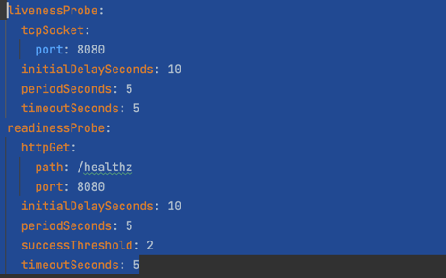
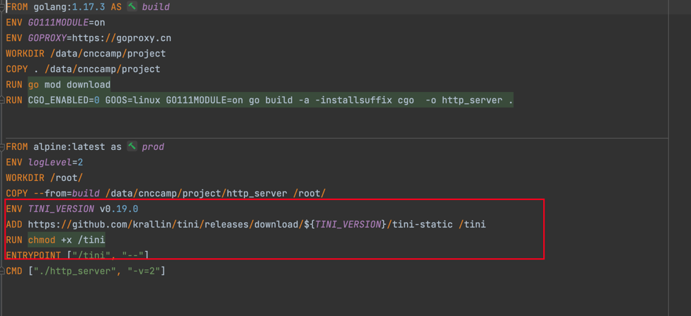
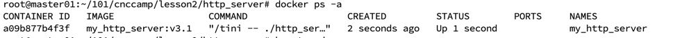
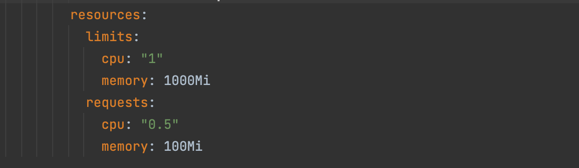
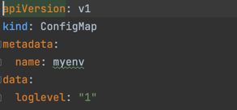
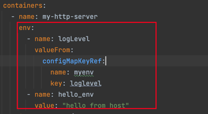
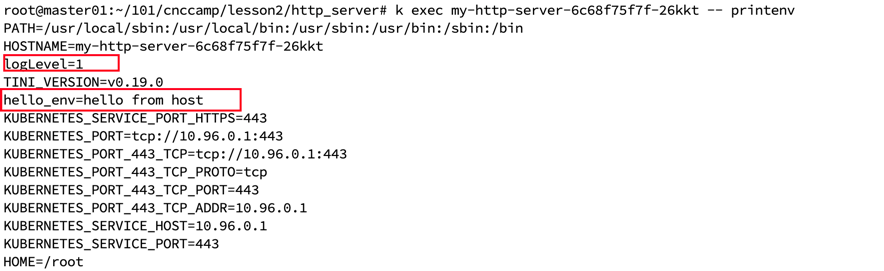

# 优雅启动

通过liveprobe 和 readness probe来完成检测

# 优雅终止

这里使用tini来做为容器的1号进程，所以需要对原先的Dockerfile加以修改

需要注意的是alpine缺少tini依赖的静态库，所以需要下载tini-static，验证docker 查看command

可以看到是由tini拉起

# 资源需求和QOS

QOS类型为：Burstable

# 代码和配置分离

采用了一个环境变量来控制logLevel 

K8s 中注入env

验证loglevel级别，k8s 管理的pod中已经是1，而Dockerfile中指定的是2

完整yaml参考lesson 8下的其他yaml文件