# 通过service来暴露服务
首先看deployment已经启动
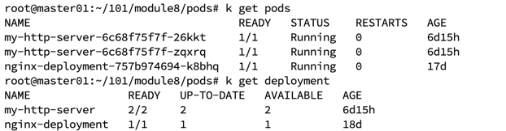
编写service.yaml
```yaml
apiVersion: v1
kind: Service
metadata:  
  labels:    
    app: httpserver  
  name: httpsvc
spec:  
  ports:    
  - port: 80      
    protocol: TCP      
    targetPort: 8080  
  selector:    
    run: my-http-server
  type: ClusterIP
```
通过k create -f my-http-service.yaml来创建service，查看svc启动后暴露的ip，以及endpoints
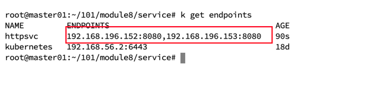
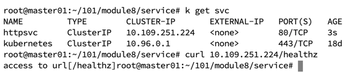

change ClusterIp -> NodePort
这样集群外部也可以访问
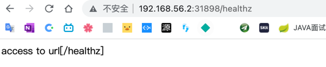

# 通过ingress来暴露服务
## 手动签发证书
首先启动ingress-nginx-controller
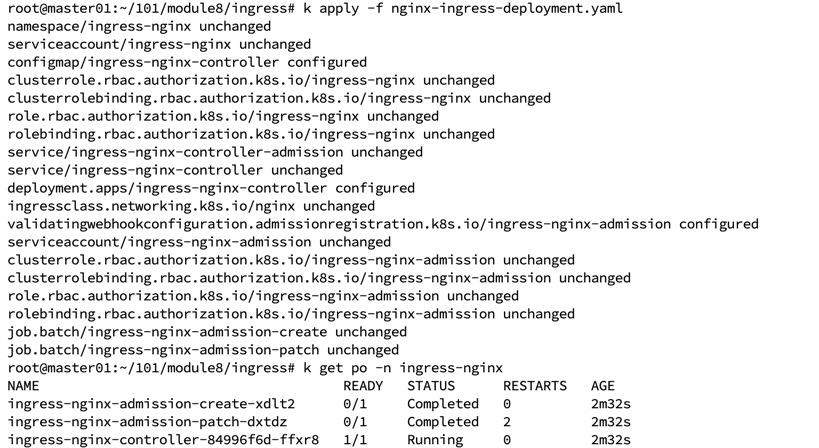

通过手动方式来生成证书
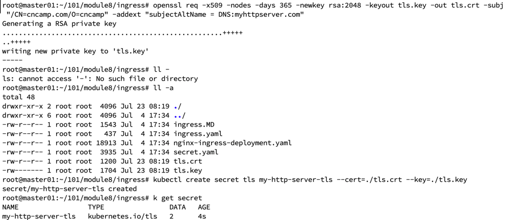

编辑myhttpserver-ingress.yaml
```yaml
apiVersion: networking.k8s.io/v1
kind: Ingress
metadata:
  name: myhttpserver-gateway
  annotations:
    kubernetes.io/ingress.class: "nginx"
spec:
  tls:
    - hosts:
        - myhttpserver.com
      secretName: my-http-server-tls
  rules:
    - host: myhttpserver.com
      http:
        paths:
          - path: "/"
            pathType: Prefix
            backend:
              service:
                name: httpsvc
                port:
                  number: 80
```

创建ingress
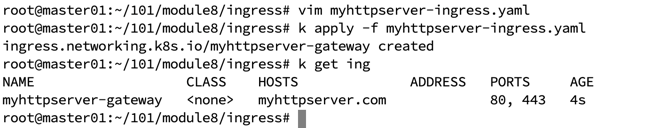

通过https访问ingress-nginx 的svc
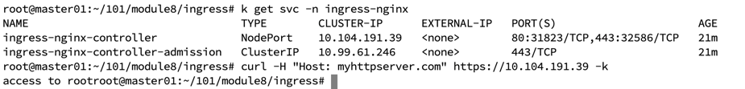

## cert-manager签发证书
创建cert-manager
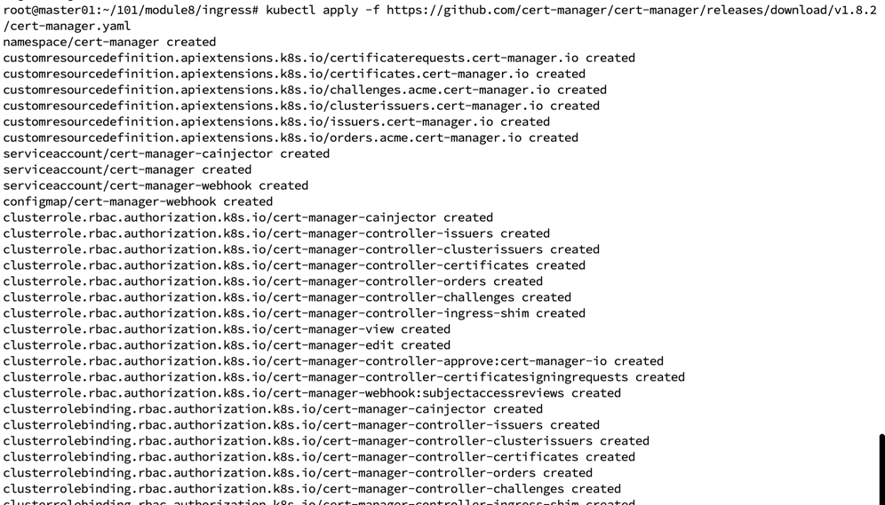
查看cert-manager namespace
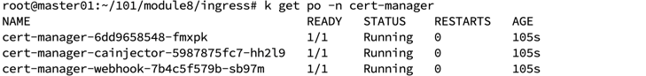

利用letsencrypt创建Issuer
```yaml
apiVersion: cert-manager.io/v1
kind: Issuer
metadata:  
  generation: 1  
  name: letsencrypt-prod
spec:  
  acme:    
    email: 13788978852@163.com    
    preferredChain: ""    
    privateKeySecretRef:      
      name: letsencrypt-prod    
    server: https://acme-v02.api.letsencrypt.org/directory    
    solvers:    
    - http01:        
        ingress:          
          class: nginx
```
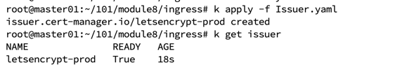

修改ingress.yaml
```yaml
apiVersion: networking.k8s.io/v1
kind: Ingress
metadata:
  name: myhttpserver-gateway-cert-manager
  annotations:
    kubernetes.io/ingress.class: "nginx"
    cert-manager.io/issuer: letsencrypt-prod
spec:
  tls:
    - hosts:
        - myhttpserver.com
      secretName: my-http-server-tls-letsencrypt
  rules:
    - host: myhttpserver.com
      http:
        paths:
          - path: "/"
            pathType: Prefix
            backend:
              service:
                name: httpsvc
                port:
                  number: 80
```
因为为本地搭建的集群，所以域名不是真实存在的，所以申请的certs状态为false
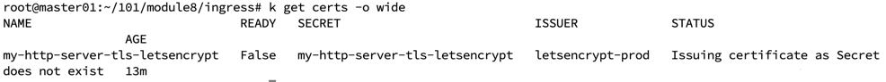
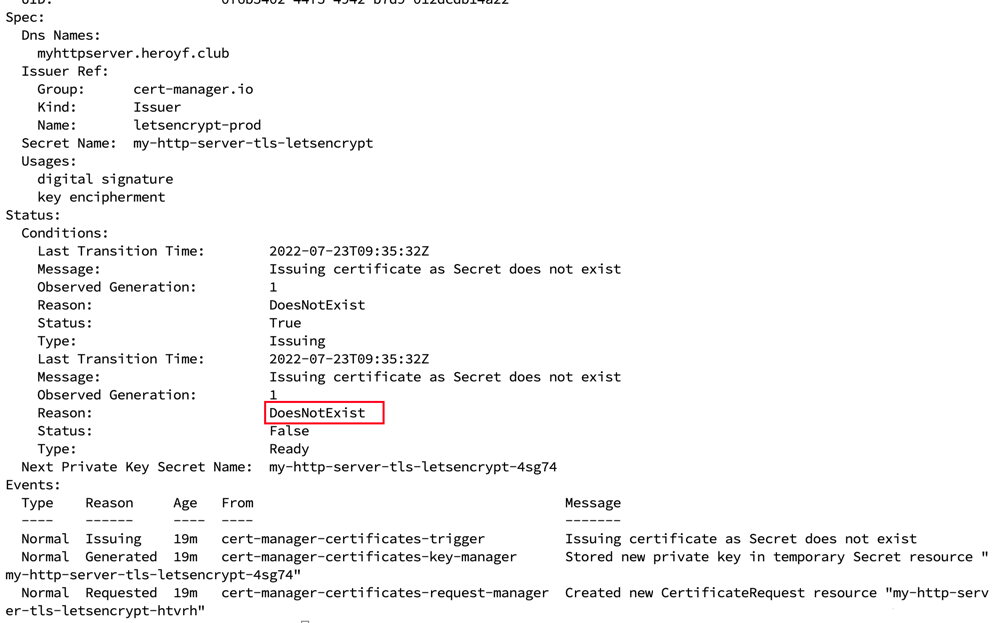