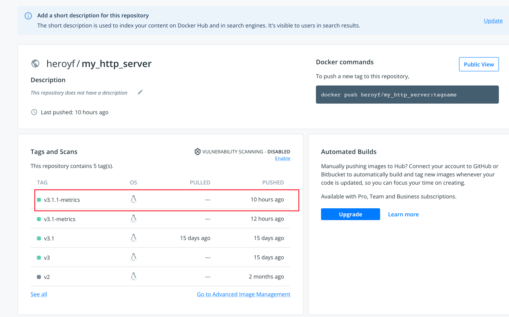
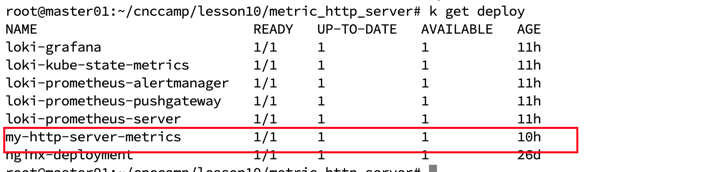
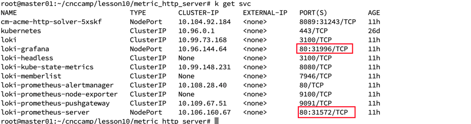
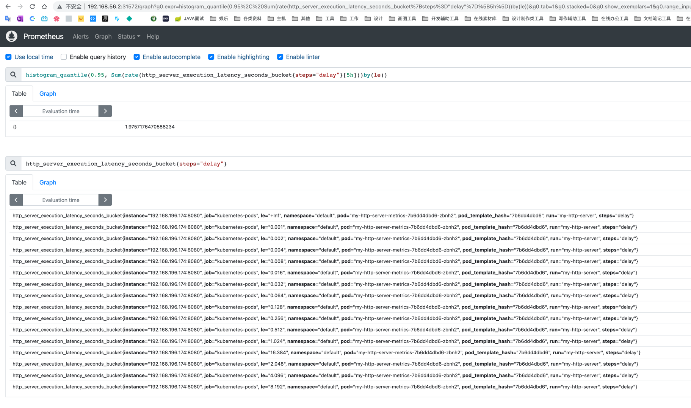
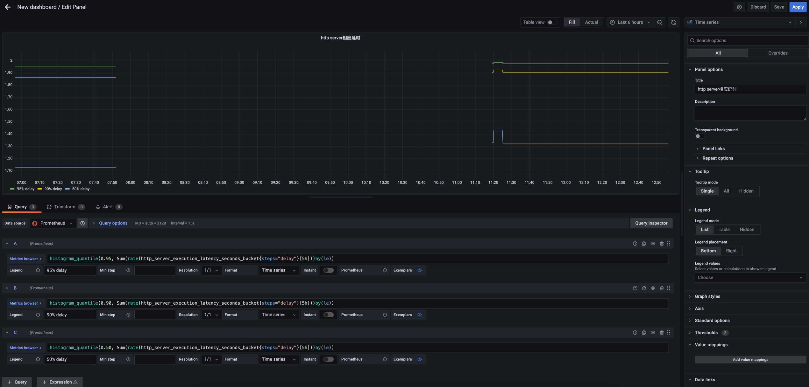
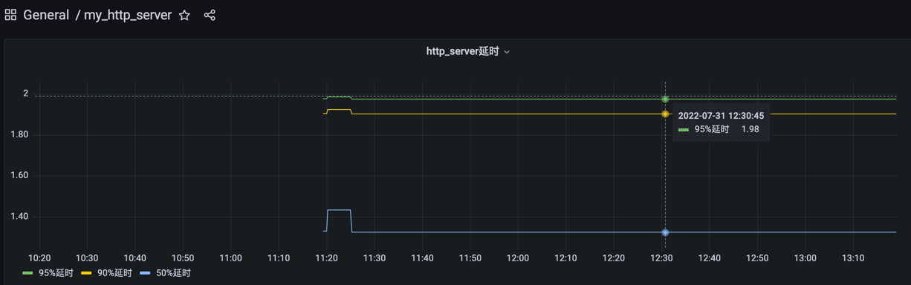

# 作业

 - 为 HTTPServer 添加 0-2 秒的随机延时；
 - 为 HTTPServer 项目添加延时 Metric；
 - 将 HTTPServer 部署至测试集群，并完成 Prometheus 配置；
 - 从 Promethus 界面中查询延时指标数据；
 - 创建一个 Grafana Dashboard 展现延时分配情况。

# 添加0-2s的随机延时，并且添加延时metric

```go
func (l LatencyHandler) GetHandleFunc() core.HandlerFunc {
	return func(c *core.Context) {
		glog.V(4).Info("enter latency handler....")
		timer := metrics.NewTimer()
		defer timer.ObserveTotal()
		// 添加0-2000ms的随机延时
		delay := randInt(0, 2000)
		time.Sleep(time.Millisecond * time.Duration(delay))
		timer.Delay = float64(delay) / 1000
		timer.ObserveDelay()
		glog.V(4).Infof("delay: %.3f s", timer.Delay)
		c.Html(http.StatusOK, fmt.Sprintf("delay: %.3f s", timer.Delay))
	}
}
```

```go
// ObserveTotal 计算handler处理总时长
func (t *ExecutionTimer) ObserveTotal() {
	(*t.histo).WithLabelValues("total").Observe(time.Now().Sub(t.start).Seconds())
}

// ObserveDelay 统计延迟时长
func (t *ExecutionTimer) ObserveDelay() {
	(*t.histo).WithLabelValues("delay").Observe(t.Delay)
}
```

具体代码在metric_http_server/handler/run_latency_handler.go和metric_http_server/metrics/metrics.go

# 部署到测试集群，并完成prometheus配置

## 构成镜像

```shell
# build 镜像
docker build -t http_server_metrics .

# 重新打tag，并推送到docker hub
docker tag http_server_metrics heroyf/my_http_server:v3.1.1-http_server_metrics
docker push
```



## 编写deployment.yaml来部署到k8s

```yaml
apiVersion: apps/v1
kind: Deployment
metadata:
  name: my-http-server-metrics
spec:
  selector:
    matchLabels:
      run: my-http-server
  replicas: 1
  strategy:
    rollingUpdate:
      maxSurge: 25%
      maxUnavailable: 25%
    type: RollingUpdate
  template:
    metadata:
      annotations:
        prometheus.io/scrape: "true"
        prometheus.io/port: "8080"
      labels:
        run: my-http-server
    spec:
      containers:
        - name: my-http-server
          image: heroyf/my_http_server:v3.1.1-metrics
          ports:
            - containerPort: 8080
          livenessProbe:
            tcpSocket:
              port: 8080
            initialDelaySeconds: 10
            periodSeconds: 5
            timeoutSeconds: 5
          readinessProbe:
            httpGet:
              path: /healthz
              port: 8080
            initialDelaySeconds: 10
            periodSeconds: 5
            successThreshold: 2
            timeoutSeconds: 5
          resources:
            limits:
              cpu: "1"
              memory: 1000Mi
            requests:
              cpu: "0.5"
              memory: 100Mi
```

复用之前的yaml，添加annotations来声明采集指标，并使用v3.1.1镜像



## 部署prometheus和grafana

通过helm指令部署

```shell
helm repo add grafana https://grafana.github.io/helm-charts
helm upgrade --install loki grafana/loki-stack --set grafana.enabled=true,prometheus.enabled=true,prometheus.alertmanager.persistentVolume.enabled=false,prometheus.server.persistentVolume.enabled=false
```

通过修改clusterIp -> NodePort来使本地浏览器可以访问



# 从prometheus中查询延时指标数据

查询语句

```shell
# 加上{steps="delay"}只获取delay的数据，如果要获取total改成{steps="total"}即可
histogram_quantile(0.95, Sum(rate(http_server_execution_latency_seconds_bucket{steps="delay"}[5h]))by(le))
```

查询最近5h内的数据



95%的请求耗时在1.975s

# grafana展示延时情况

新建一个dashboard,并配置以下查询数据



保存，并展示



grafana json model
```json
{
  "annotations": {
    "list": [
      {
        "builtIn": 1,
        "datasource": "-- Grafana --",
        "enable": true,
        "hide": true,
        "iconColor": "rgba(0, 211, 255, 1)",
        "name": "Annotations & Alerts",
        "target": {
          "limit": 100,
          "matchAny": false,
          "tags": [],
          "type": "dashboard"
        },
        "type": "dashboard"
      }
    ]
  },
  "editable": true,
  "fiscalYearStartMonth": 0,
  "graphTooltip": 0,
  "id": 1,
  "links": [],
  "liveNow": false,
  "panels": [
    {
      "datasource": {
        "type": "prometheus",
        "uid": "PBFA97CFB590B2093"
      },
      "fieldConfig": {
        "defaults": {
          "color": {
            "mode": "palette-classic"
          },
          "custom": {
            "axisLabel": "",
            "axisPlacement": "auto",
            "barAlignment": 0,
            "drawStyle": "line",
            "fillOpacity": 0,
            "gradientMode": "none",
            "hideFrom": {
              "legend": false,
              "tooltip": false,
              "viz": false
            },
            "lineInterpolation": "linear",
            "lineWidth": 1,
            "pointSize": 5,
            "scaleDistribution": {
              "type": "linear"
            },
            "showPoints": "auto",
            "spanNulls": false,
            "stacking": {
              "group": "A",
              "mode": "none"
            },
            "thresholdsStyle": {
              "mode": "off"
            }
          },
          "mappings": [],
          "thresholds": {
            "mode": "absolute",
            "steps": [
              {
                "color": "green",
                "value": null
              },
              {
                "color": "red",
                "value": 80
              }
            ]
          }
        },
        "overrides": []
      },
      "gridPos": {
        "h": 9,
        "w": 12,
        "x": 0,
        "y": 0
      },
      "id": 2,
      "options": {
        "legend": {
          "calcs": [],
          "displayMode": "list",
          "placement": "bottom"
        },
        "tooltip": {
          "mode": "single"
        }
      },
      "targets": [
        {
          "datasource": {
            "type": "prometheus",
            "uid": "PBFA97CFB590B2093"
          },
          "exemplar": true,
          "expr": "histogram_quantile(0.95, Sum(rate(http_server_execution_latency_seconds_bucket{steps=\"delay\"}[5h]))by(le))",
          "interval": "",
          "legendFormat": "95%延时",
          "refId": "A"
        },
        {
          "datasource": {
            "type": "prometheus",
            "uid": "PBFA97CFB590B2093"
          },
          "exemplar": true,
          "expr": "histogram_quantile(0.90, Sum(rate(http_server_execution_latency_seconds_bucket{steps=\"delay\"}[5h]))by(le))",
          "hide": false,
          "interval": "",
          "legendFormat": "90%延时",
          "refId": "B"
        },
        {
          "datasource": {
            "type": "prometheus",
            "uid": "PBFA97CFB590B2093"
          },
          "exemplar": true,
          "expr": "histogram_quantile(0.50, Sum(rate(http_server_execution_latency_seconds_bucket{steps=\"delay\"}[5h]))by(le))",
          "hide": false,
          "interval": "",
          "legendFormat": "50%延时",
          "refId": "C"
        }
      ],
      "title": "http_server延时",
      "type": "timeseries"
    }
  ],
  "refresh": "",
  "schemaVersion": 34,
  "style": "dark",
  "tags": [],
  "templating": {
    "list": []
  },
  "time": {
    "from": "now-3h",
    "to": "now"
  },
  "timepicker": {},
  "timezone": "",
  "title": "my_http_server",
  "uid": "p9sHZ5k4z",
  "version": 1,
  "weekStart": ""
}
```