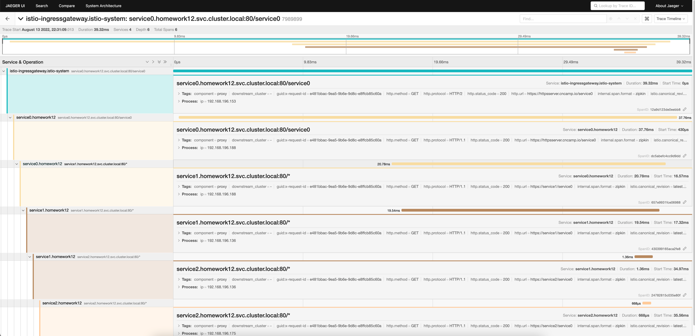

# 作业
把我们的 httpserver 服务以 Istio Ingress Gateway 的形式发布出来。以下是你需要考虑的几点：

- 如何实现安全保证；
- 七层路由规则；
- 考虑 open tracing 的接入。

# 安全证书

## 创建对应ns并打上istio label

kubectl create ns homework12
kubectl label ns homework12 istio-injection=enabled

## 生成key和crt

openssl req -x509 -sha256 -nodes -days 365 -newkey rsa:2048 -subj '/O=cncamp Inc./CN=*.cncamp.io' -keyout cncamp.io.key -out cncamp.io.crt

## 创建对应的secret(ns: istio-system)

kubectl create -n istio-system secret tls cncamp-credential --key=cncamp.io.key --cert=cncamp.io.crt

## 创建服务svc

```shell
root@master01:~/cnccamp/lesson12# k create -f httpserver.yaml -n homework12
root@master01:~/cnccamp/lesson12# k get pods -n homework12
NAME                          READY   STATUS    RESTARTS   AGE
httpserver-7695b8c7bf-mb6ms   2/2     Running   0          87s
```

## 创建istio vs和gateway

对应yaml istio-spec.yaml

```shell
root@master01:~/cnccamp/lesson12# k create -f istio-spec.yaml -n homework12
root@master01:~/cnccamp/lesson12# k get vs -n homework12
NAME          GATEWAYS          HOSTS                       AGE
httpsserver   ["httpsserver"]   ["httpsserver.cncamp.io"]   2m32s
root@master01:~/cnccamp/lesson12# k get gateway -n homework12
NAME          AGE
httpsserver   2m39s
```

## 获取ingress gateway ip
```shell
root@master01:~/cnccamp/lesson12# k get svc -n istio-system
NAME                   TYPE           CLUSTER-IP       EXTERNAL-IP   PORT(S)                                                                      AGE
istio-ingressgateway   LoadBalancer   10.100.230.108   <pending>     15021:32203/TCP,80:31191/TCP,443:31679/TCP,31400:31342/TCP,15443:31179/TCP   2d17h
```

## 验证
```shell
root@master01:~/cnccamp/lesson12# curl --resolve httpsserver.cncamp.io:443:10.100.230.108 https://httpsserver.cncamp.io/healthz -k
access to url[/healthz]
```

# 7层转发规则

对应yaml istio-l7.yaml

## 创建对应vs

```shell
root@master01:~/cnccamp/lesson12# k create -f istio-l7.yaml -n homework12
virtualservice.networking.istio.io/httpsserver-l7 created
```

## 验证

/l7/header -> /header

```shell
root@master01:~/cnccamp/lesson12# curl --resolve httpsserver.cncamp.io:443:10.100.230.108 https://httpsserver.cncamp.io/l7/header -k
{"Accept":["[*/*]"],"Content-Type":["application/json"],"Sys-Version":["v0.1.0"],"User-Agent":["[curl/7.68.0]"],"X-B3-Parentspanid":["[6e41f57949561abf]"],"X-B3-Sampled":["[1]"],"X-B3-Spanid":["[bc597aeff6bbf118]"],"X-B3-Traceid":["[16322fc3aff53d876e41f57949561abf]"],"X-Envoy-Attempt-Count":["[1]"],"X-Envoy-Internal":["[true]"],"X-Envoy-Original-Path":["[/l7/header]"],"X-Forwarded-Client-Cert":["[By=spiffe://cluster.local/ns/homework12/sa/default;Hash=fe0b79eb90ea56ee04627d2d2f00fc6b3b977beaad896a5cb63d11ea87e4018f;Subject=\"\";URI=spiffe://cluster.local/ns/istio-system/sa/istio-ingressgateway-service-account]"],"X-Forwarded-For":["[192.168.56.2]"],"X-Forwarded-Proto":["[https]"],"X-Request-Id":["[60946ee0-08ce-9314-9028-292c4cf39a1b]"]}
```

## open tracing 接入

改造my_http_server，支持svc0 发往 svc1 最终发往 svc2
```shell
# 创建service0、service1、service2
root@master01:~/cnccamp/lesson12# k create -f service0.yaml -n homework12
root@master01:~/cnccamp/lesson12# k create -f service1.yaml -n homework12
root@master01:~/cnccamp/lesson12# k create -f service2.yaml -n homework12
```

检查pod启动情况
```shell
root@master01:~/cnccamp/lesson12# k get pods -n homework12
NAME                          READY   STATUS    RESTARTS   AGE
httpserver-54fd74d8ff-bl2zl   2/2     Running   0          5h59m
service0-84b6b9d9fd-lvqxf     2/2     Running   0          39m
service1-58877cb6cc-bqm9w     2/2     Running   0          63m
service2-69987f4797-qbrwf     2/2     Running   0          20m
```

创建virtualservice，新建规则

```shell
root@master01:~/cnccamp/lesson12# k create -f istio-svc-tracing.yaml
```

循环调用
```shell
root@master01:~/cnccamp/lesson12# for i in {1..100}; do curl --resolve httpsserver.cncamp.io:443:$INGRESS_IP https://httpsserver.cncamp.io/service0 -k; done
```

安装jaeger，并启动
```shell
root@master01:~/101/module12/istio/tracing# k create -f jaeger.yaml
root@master01:~/101/module12/istio/tracing# istioctl dashboard jaeger --address=0.0.0.0
http://0.0.0.0:16686
Failed to open browser; open http://0.0.0.0:16686 in your browser.
```

查看tracing情况


